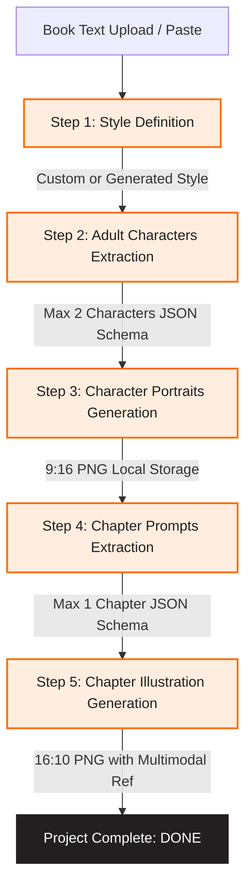
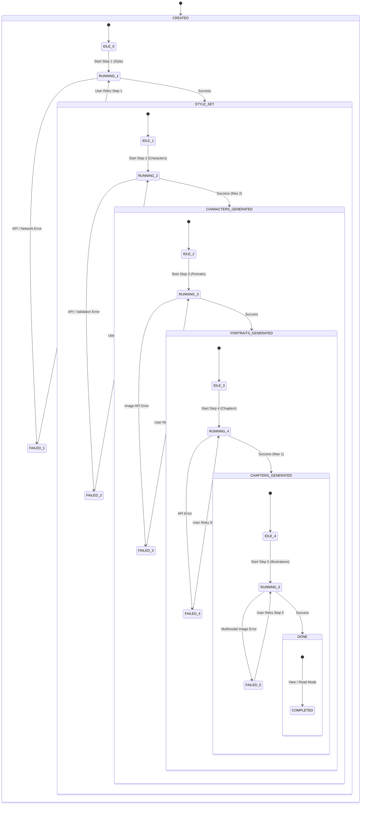
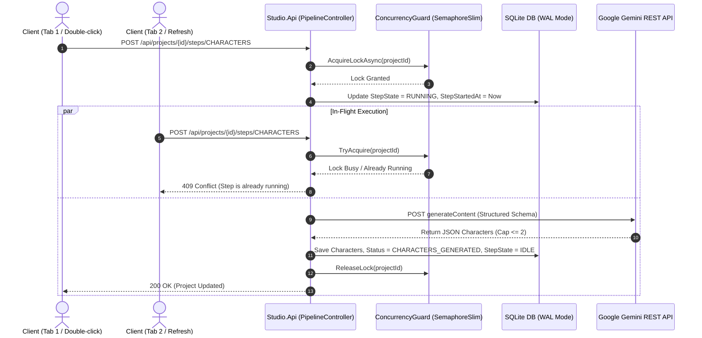
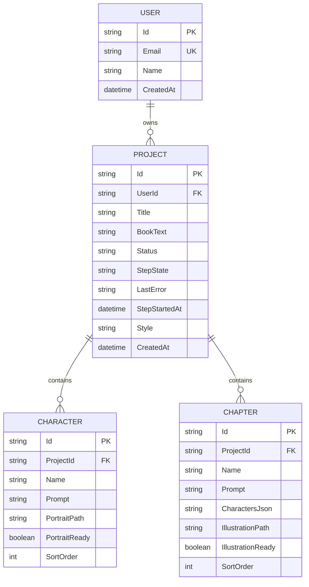

# Architecture Overview & Specifications

## 1. System Pipeline Architecture (5-Step Sequential Workflow)

---

## 2. Dual-Status State Machine

To guarantee that mid-step refreshes, page reloads, and network interruptions are handled without losing data or causing stuck states, state is separated into **Milestone Status** and **Runtime Step State**.

---

## 3. Concurrency & Locking Model

---

## 4. Entity Relationship Schema

