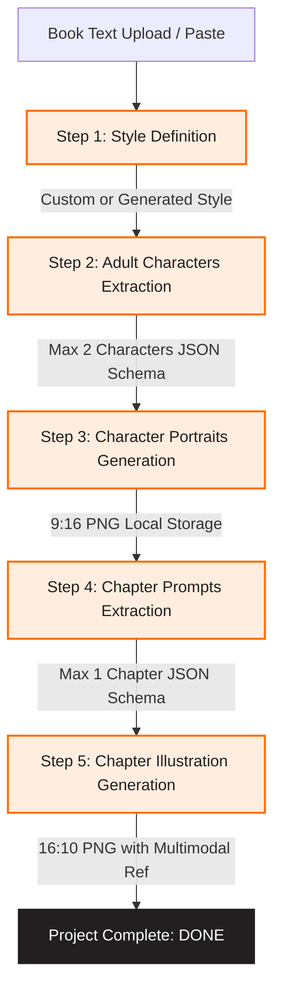
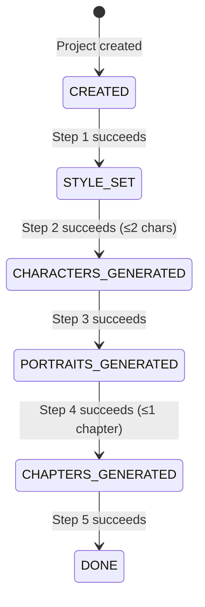
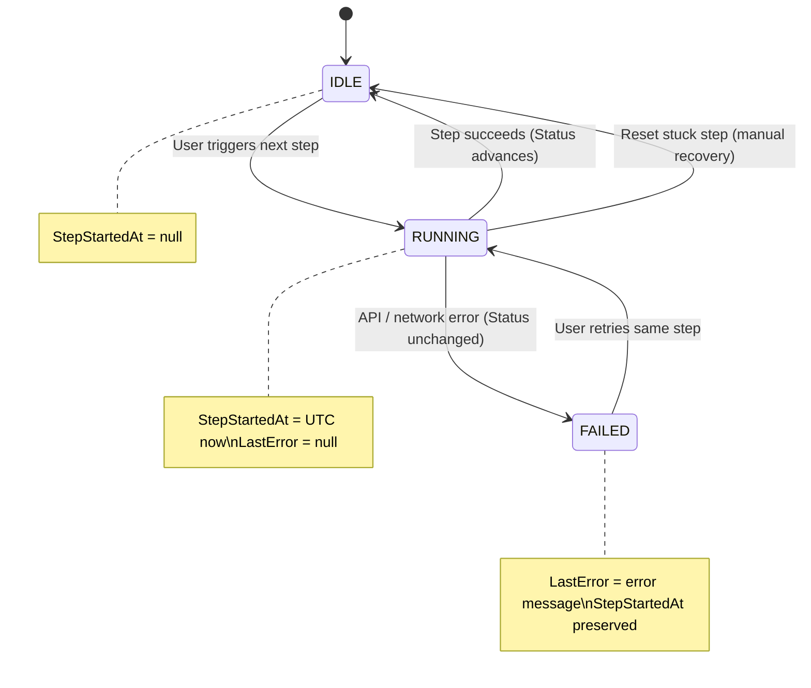
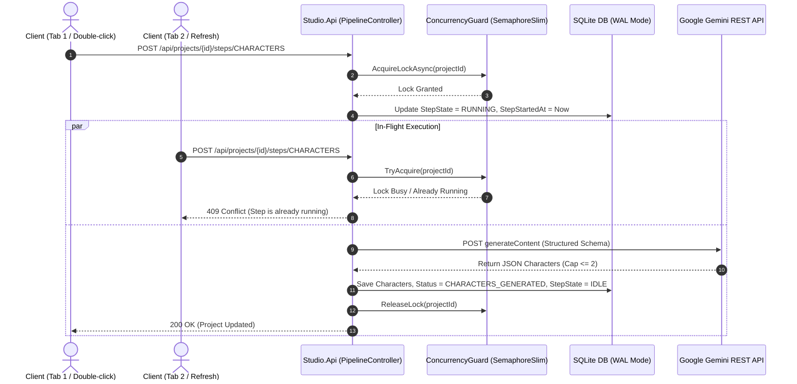
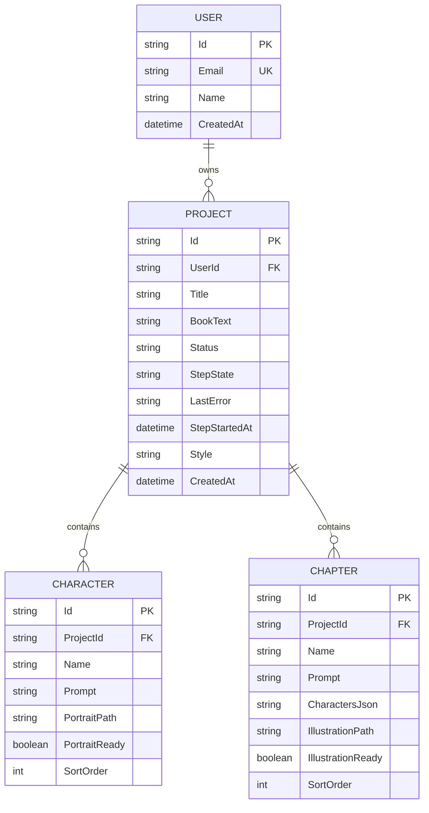

# Architecture Overview & Specifications

## 1. System Pipeline Architecture (5-Step Sequential Workflow)

---

## 2. Dual-Status State Machine

To guarantee that mid-step refreshes, page reloads, and network interruptions are handled without losing data or causing stuck states, state is tracked with **two independent flat fields** on each `Project` row:

- **`Status`** (Milestone): Records the *last completed* pipeline step. Only advances forward on success.
- **`StepState`** (Runtime): Records whether any step is *currently executing*. Resets on completion or failure.

### Milestone Progression (`Project.Status`)

### Runtime Execution Cycle (`Project.StepState`)

Every step follows the same cycle — `StepState` is shared across all steps:

### How a Browser Refresh Reads State

| `Status` | `StepState` | UI Interpretation |
|:---|:---|:---|
| `CHARACTERS_GENERATED` | `IDLE` | Step 2 done. Show "Generate Portraits" button. |
| `CHARACTERS_GENERATED` | `RUNNING` | Step 3 in-flight. Show spinner + poll for portraits. |
| `CHARACTERS_GENERATED` | `FAILED` | Step 3 failed. Show error + Retry button. |
| `CHARACTERS_GENERATED` | `RUNNING` + stale `StepStartedAt` | Step 3 stuck (server died). Show recovery affordance. |

---

## 3. Concurrency & Locking Model

---

## 4. Entity Relationship Schema

